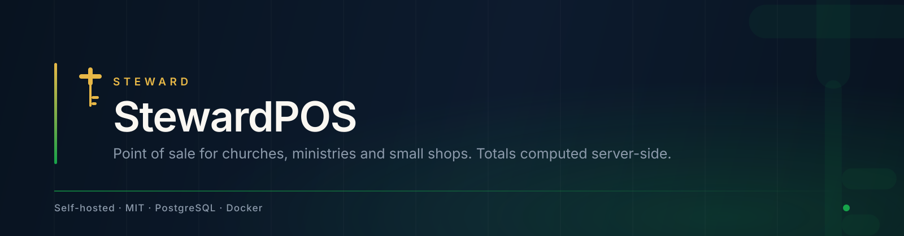
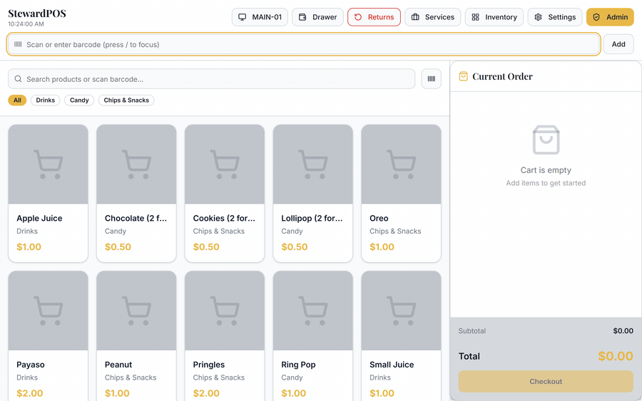
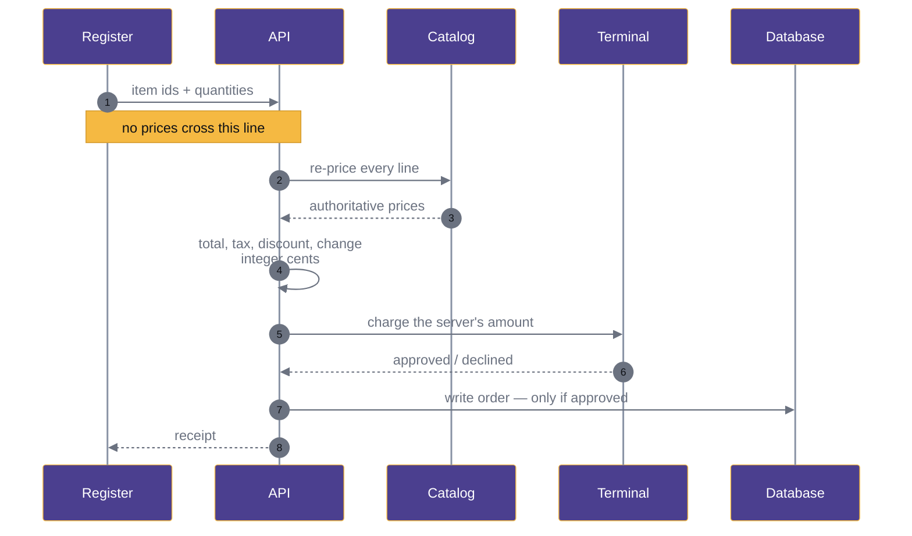
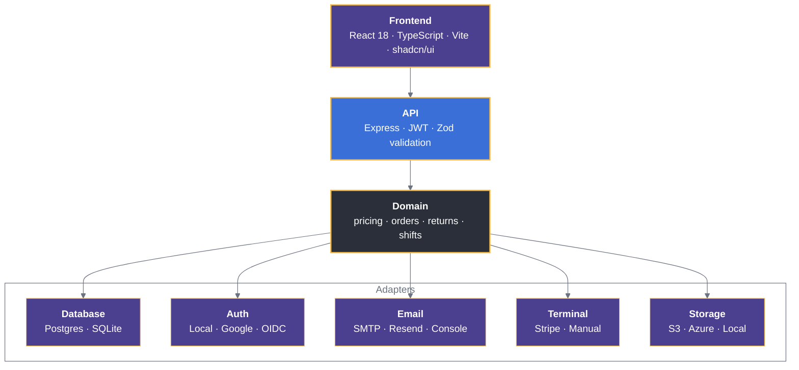
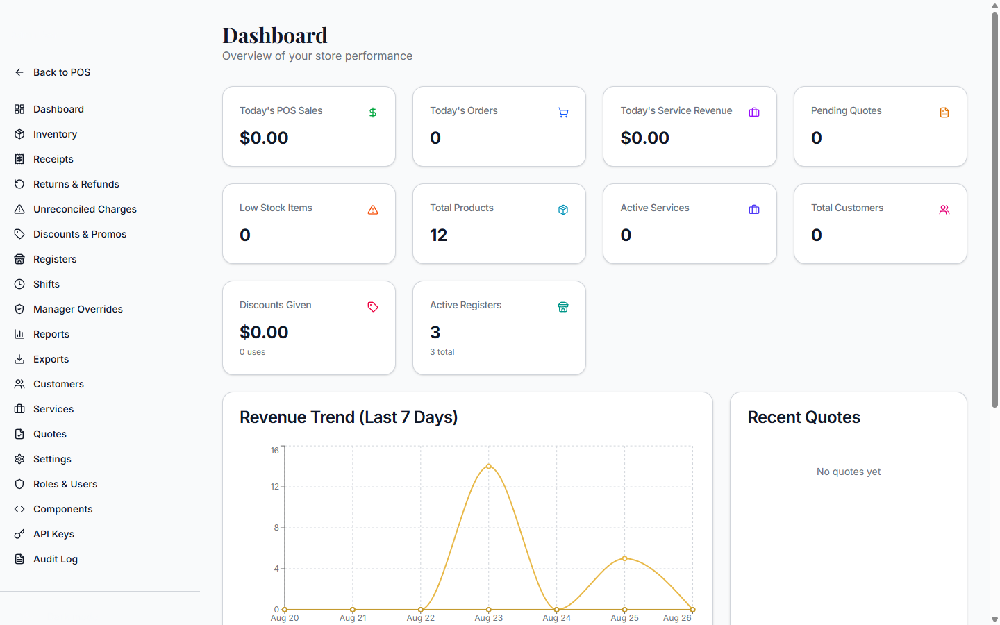
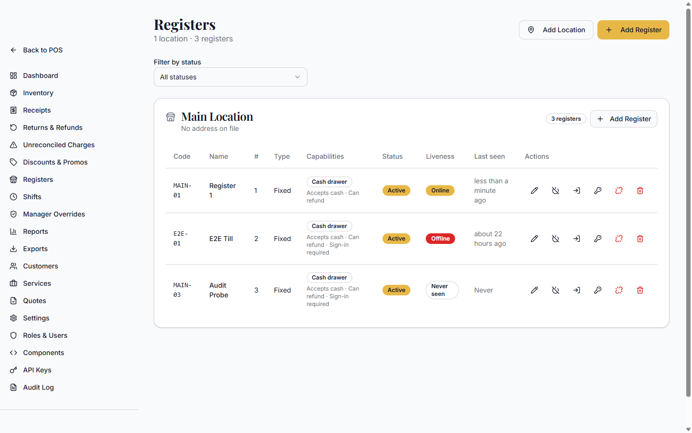

<div align="center">



<br><br>

<a href="https://github.com/24Skater/stewardpos/actions/workflows/ci.yml"></a>
<a href="CHANGELOG.md"></a>
<a href="LICENSE"></a>
<a href="docker-compose.yml"></a>

<br><br>

**[Quick start](#quick-start)** &nbsp;·&nbsp;
**[What it does](#what-it-does)** &nbsp;·&nbsp;
**[How the money moves](#how-the-money-moves)** &nbsp;·&nbsp;
**[Status](#status)** &nbsp;·&nbsp;
**[Docs](#documentation)**

</div>

<br>

A point-of-sale system you run on your own server. It was built for a church
bookstore — volunteers on the register, one laptop in the back — and it works
the same way for any small shop.

Prices are never trusted from the register. Every total, tax line, discount and
refund is recomputed on the server in integer cents. That one decision shapes
most of what follows.

<br>

<div align="center">
  
  <br>
  <sub><b>One sale, start to finish.</b> Four items, a 10% discount, $10 cash, $5.50 change —
  every figure recomputed server-side before the order is written.</sub>
</div>

<br>

---

## What it does

<table>
<tr>
<td width="33%" valign="top">

 **Register**

Barcode scan, product variants, cash and split tender, discounts, change due, receipt print or email.

</td>
<td width="33%" valign="top">

 **Inventory**

Catalog with variants and images, live stock, low-stock alerts, CSV in and out.

</td>
<td width="33%" valign="top">

 **Returns**

Receipt lookup, item-level refunds, gated restock, store credit, reason codes.

</td>
</tr>
<tr>
<td valign="top">

 **Registers & locations**

Real location entities, per-location numbering, device pairing by code, online/idle/offline heartbeat.

</td>
<td valign="top">

 **Till sign-on**

Six-digit cashier PIN, shifts rather than logins, lock screen, lockout after five failures.

</td>
<td valign="top">

 **Manager override**

Supervisor PIN, ninety seconds, single use, matched to one action, approver logged.

</td>
</tr>
<tr>
<td valign="top">

 **Discounts & promos**

Quick buttons, promo codes, employee rates, approval routing, usage tracking.

</td>
<td valign="top">

 **Reports**

Server-side sales, revenue and product performance by register, cashier and location. PDF, Excel, CSV.

</td>
<td valign="top">

 **Audit & access**

Role-based access with custom roles, filterable audit log, API keys, encrypted credentials.

</td>
</tr>
</table>

<br>

---

## Quick start

**Requires** Docker and Docker Compose. Nothing else.

```bash
git clone https://github.com/24Skater/stewardpos.git
cd stewardpos
docker compose up -d
```

Open **http://localhost:8081** and complete the setup wizard — admin account,
database, authentication. That is the whole install.

<details>
<summary><b>Run the seeded demo instead</b></summary>

<br>

```bash
docker compose -f docker-compose.demo.yml up -d
```

Signs you in with sample products and orders already loaded:

```
Email     admin@demo.local
Password  DemoPass!1
```

Demo credentials are seeded data. Never point this compose file at a real install.
See [docs/guides/demo.md](docs/guides/demo.md).

</details>

<details>
<summary><b>Local development without Docker</b></summary>

<br>

**Requires** Node.js 18+, PostgreSQL 14+, pnpm.

```bash
# API — http://localhost:3002
cd backend
pnpm install
cp env.example .env
pnpm run setup-db
pnpm dev
```

```bash
# Frontend — http://localhost:5173, proxies /api
pnpm install
pnpm dev
```

Configuration lives in `backend/.env`. The frontend `.env` holds four
build-time values and no secrets — see
[docs/reference/environment.md](docs/reference/environment.md).

</details>

<br>

---

## How the money moves

The register sends *intent* — which items, how many. It never sends a price.
The server re-prices from the catalog, computes every figure in integer cents,
and writes no order unless the charge is approved.



A declined card provably creates no order. A tampered register changes nothing
but its own display.

<br>

---

## Architecture

Ports and adapters. Business logic depends on interfaces; the concrete provider
is chosen by environment variable.



<br>

<table>
<tr>
<td width="50%" valign="top">

<sub><b>Admin.</b> Store performance, reports, exports, audit log.</sub>
</td>
<td width="50%" valign="top">

<sub><b>Registers.</b> Pairing, liveness, capabilities, revocation.</sub>
</td>
</tr>
</table>

<br>

---

## Status

Version **1.0.0**. All nine phases of the [master plan](docs/masterplan/README.md)
are complete, plus register management and PIN till sign-on.

<table>
<tr>
<td width="50%" valign="top">

 **Working, covered by tests**

The money path end to end — cash and split tender, drawer sessions, returns with
gated restock, store credit, discounts and promo codes. Inventory, server-side
reporting, branding, registers, shifts, manager overrides, and a filterable
audit log.

</td>
<td width="50%" valign="top">

 **Not yet verified**

Two items need hardware nobody has run yet. Both are written end to end; neither
has met the real world.

</td>
</tr>
</table>

| Gap | Where it stands |
|---|---|
| **Card payments are unverified** | `StripeTerminalAdapter` creates a real PaymentIntent, drives the reader, maps every status, and creates no order unless approved. It has never run against real credentials with a reader attached. **Card is off by default — cash is the tender to rely on.** |
| **No install verified on a real VPS** | The [guide](docs/guides/install-vps.md) is complete and the stack validates, but nobody has followed it start to finish on a clean server. |
| **Multi-tenant is a foundation, not a feature** | `org_id` exists on 20 tables; no query filters on it. Single-tenant only — see [multi-tenant.md](docs/guides/multi-tenant.md). |
| **Deferred by decision** | Services and quotes, full CRM, SSO, SMS, offline/PWA, non-Stripe terminals. Backlog in [phase-9](docs/masterplan/phase-9-golive.md). |

This section is checked against running code rather than restating plans. An
earlier version listed features as complete that an audit found broken.

<br>

---

## Documentation

The [`docs/`](docs/README.md) tree is ordered by authority — the
[changelog](CHANGELOG.md) outranks the plan, the plan outranks the guides.

| | | |
|---|---|---|
|  **Install on a VPS** | The supported path, start to finish | [guides/install-vps.md](docs/guides/install-vps.md) |
|  **Backup & restore** | Set this up on day one | [guides/backup-restore.md](docs/guides/backup-restore.md) |
|  **Operations** | Logs, health checks, troubleshooting | [guides/operations.md](docs/guides/operations.md) |
|  **Register management** | Locations, pairing, liveness, readers | [guides/register-management.md](docs/guides/register-management.md) |
|  **API keys** | Machine access and scoping | [guides/api-keys.md](docs/guides/api-keys.md) |
|  **Environment reference** | Every variable the code reads | [reference/environment.md](docs/reference/environment.md) |
|  **Master plan** | Phases 0–9 and the locked decisions | [masterplan/README.md](docs/masterplan/README.md) |
|  **Upgrading** | Version-to-version steps | [guides/upgrade.md](docs/guides/upgrade.md) |

<br>

---

## Stack

| Layer | Built with |
|---|---|
| Frontend | React 18, TypeScript, Vite, Tailwind, shadcn/ui |
| API | Node.js, Express, JWT, Zod |
| Data | PostgreSQL (SQLite adapter for tests) |
| Delivery | Docker Compose, Caddy or nginx |

<br>

---

## Security

bcrypt hashing, JWT sessions, role-based access, Zod validation at every
boundary, parameterised queries, Helmet headers, rate limiting, encrypted
payment credentials, and a complete audit log.

Found a vulnerability? Report it privately — **security@stewardpos.dev**. Do not
open a public issue. See [SECURITY.md](SECURITY.md).

<br>

---

## Contributing

```bash
git clone https://github.com/YOUR_USERNAME/stewardpos.git
cd stewardpos && pnpm install
git checkout -b feat/your-change
pnpm test:run && pnpm typecheck
```

Conventional commits, tests alongside new behaviour, docs updated in the same
change. Full guidelines in [CONTRIBUTING.md](CONTRIBUTING.md); open issues are
[here](https://github.com/24Skater/stewardpos/issues).

<br>

---

## Why this exists

<table>
<tr>
<td>

 Our church bookstore needed a register. Everything on the market was priced
for a chain or complicated enough to need training. So this got built instead —
simple enough for volunteers, free, and self-hosted so the data stays with the
ministry that collected it.

It works just as well for any small shop. That was never a compromise.

> *"Whatever you do, work at it with all your heart, as working for the Lord,
> not for human masters."* — Colossians 3:23

</td>
</tr>
</table>

<br>

---

<div align="center">

 **[MIT](LICENSE)** — commercial use, modification, distribution, private use.

<sub>Brand assets and usage rules: <a href="branding/README.md">branding/README.md</a></sub>

<br><br>

<a href="#quick-start">Quick start</a> &nbsp;·&nbsp;
<a href="docs/README.md">Docs</a> &nbsp;·&nbsp;
<a href="CHANGELOG.md">Changelog</a> &nbsp;·&nbsp;
<a href="https://github.com/24Skater/stewardpos/issues">Issues</a>

</div>
